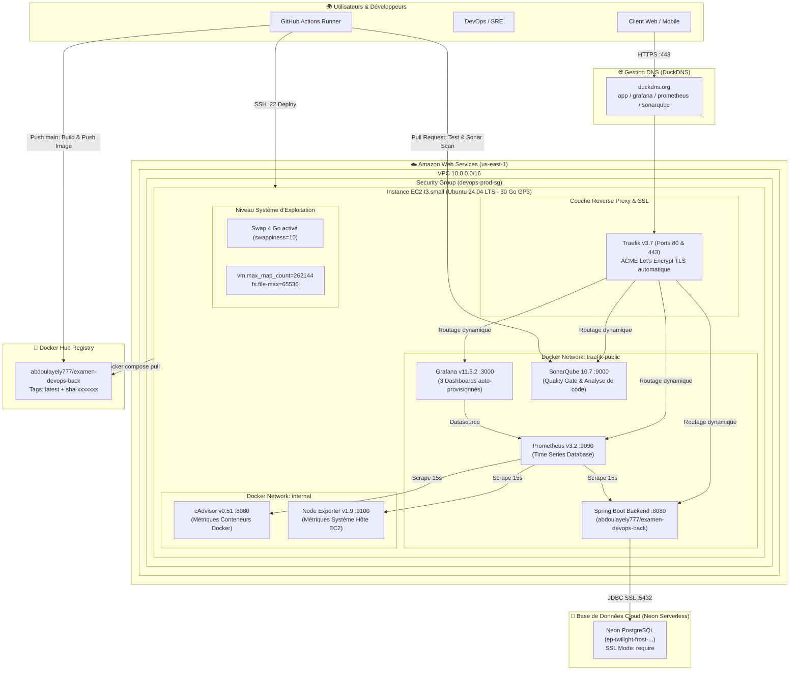

# Projet DevOps — Architecture Cloud de Production

> Plateforme de production complète, reproductible, sécurisée et conteneurisée déployée sur **Amazon Web Services (AWS)** orchestrant une application **Spring Boot 3 (Java 21)**, une base de données **Neon PostgreSQL**, un reverse-proxy **Traefik**, une stack d'observabilité (**Prometheus, Grafana, cAdvisor, Node Exporter**), une gouvernance qualité (**SonarQube**) et une chaîne d'intégration et déploiement continus (**GitHub Actions CI/CD**).

---

## 1. Schéma d'Architecture Globale



---

## 2. Table de Routage & URLs Publiques de Production

Tous les services sont sécurisés avec des certificats **SSL Let's Encrypt valides**, renouvelés automatiquement par Traefik via le challenge HTTP-01 :

| Service | URL Publique HTTPS | Port Interne | Authentification / Rôle |
| :--- | :--- | :--- | :--- |
| **Backend API (Root)** | 👉 [https://app-lydevtech.duckdns.org](https://app-lydevtech.duckdns.org) | `8080` | Endpoint de bienvenue et statut de l'API (`HTTP 200 OK`) |
| **Backend Health (Actuator)** | 👉 [https://app-lydevtech.duckdns.org/actuator/health](https://app-lydevtech.duckdns.org/actuator/health) | `8080` | Statut santé applicatif, validation Neon PostgreSQL & disque |
| **Backend Metrics** | 👉 [https://app-lydevtech.duckdns.org/actuator/prometheus](https://app-lydevtech.duckdns.org/actuator/prometheus) | `8080` | Métriques JVM, Garbage Collector et HikariCP |
| **Grafana** | 👉 [https://grafana-lydevtech.duckdns.org](https://grafana-lydevtech.duckdns.org) | `3000` | Tableaux de bord de surveillance (`admin` / `admin`) |
| **Prometheus** | 👉 [https://prometheus-lydevtech.duckdns.org](https://prometheus-lydevtech.duckdns.org) | `9090` | Moteur de requêtage PromQL et état des 4 cibles (1/1 UP) |
| **SonarQube** | 👉 [https://sonarqube-lydevtech.duckdns.org](https://sonarqube-lydevtech.duckdns.org) | `9000` | Analyse statique de code, bugs, vulnérabilités et Quality Gate |

---

## 3. Matrice des Répertoires & Rôles

Le projet est divisé en deux repositories complémentaires suivant la séparation des responsabilités **Dev** et **Ops** :

### Repository 1 : `examen-devops-infra` (Ce repository)
Gère l'intégralité du cycle de vie de l'infrastructure et de la plateforme d'hébergement :
- **[`terraform/`](./terraform/README.md)** : Couche **Day 0** — Provisionnement de l'infrastructure Cloud AWS (VPC, Subnet, Route Table, Internet Gateway, Security Group, Clé SSH ED25519, Instance EC2 et génération d'inventaire dynamique).
- **[`ansible/`](./ansible/README.md)** : Couche **Day 1** — Configuration du serveur et orchestration de la stack conteneurisée (Swap 4 Go, Docker CE 29+, Traefik, Prometheus, Grafana, cAdvisor, Node Exporter, SonarQube, Stack applicative).

### Repository 2 : `examen-devops` (Repository applicatif Java)
Gère le cycle de développement logiciel et la livraison continue :
- **`src/`** : Code source Java 21 / Spring Boot 3.5.14, entités JPA, repositories et controllers.
- **`Dockerfile`** : Build multi-stage optimisé (Maven 3.9 Temurin 21 + JRE 21 minimal).
- **`docker-compose.yml`** : Environnement d'exécution de développement local (port `8080:8080`, sans dépendance externe).
- **[`.github/workflows/`](../examen-devops/.github/workflows/README.md)** : Couche **Day 2** — Pipelines automatisés :
  - **`ci.yml`** : Déclenché lors de chaque Pull Request vers `main` (build, tests isolés H2, analyse SonarQube).
  - **`deploy.yml`** : Déclenché lors du merge sur `main` (condition stricte de tests réussis, build image Docker Hub, déploiement SSH sur EC2, smoke test).

---

## 4. Déploiement Initial de Bout en Bout (Guide Pas à Pas)

### Étape 1 : Provisionner l'infrastructure Cloud (Terraform)
```bash
cd terraform
terraform init
terraform plan
terraform apply -auto-approve
```
*Outputs générés : IP publique de l'EC2, clé SSH dans `~/.ssh/devops-prod-key`, et inventaire dans `ansible/inventory/production.ini`.*

### Étape 2 : Mettre à jour DuckDNS
1. Se connecter sur [duckdns.org](https://www.duckdns.org).
2. Associer la nouvelle IP publique de l'EC2 aux 4 sous-domaines :
   - `app-lydevtech`
   - `grafana-lydevtech`
   - `sonarqube-lydevtech`
   - `prometheus-lydevtech`

### Étape 3 : Configurer le serveur et lancer la stack (Ansible)
```bash
cd ../ansible
# 1. Vérifier la connectivité SSH
ansible -i inventory/production.ini prod-ec2 -m ping

# 2. Exécuter le playbook d'infrastructure
ansible-playbook -i inventory/production.ini site.yml
```

### Étape 4 : Configurer le pipeline CI/CD (GitHub Secrets)
Dans le repository GitHub applicatif, renseigner les 7 secrets :
- `DOCKERHUB_USERNAME` : `abdoulayely777`
- `DOCKERHUB_TOKEN` : Personal Access Token Docker Hub
- `EC2_HOST` : IP publique de l'EC2
- `EC2_USER` : `ubuntu`
- `EC2_SSH_PRIVATE_KEY` : Contenu de `~/.ssh/devops-prod-key`
- `SONAR_HOST_URL` : `https://sonarqube-lydevtech.duckdns.org`
- `SONAR_TOKEN` : Token généré sur SonarQube

### Étape 5 : Livrer une fonctionnalité via Pull Request
```bash
cd ../examen-devops
git checkout -b feature/ma-fonctionnalite
# Développement et commits...
git push -u origin feature/ma-fonctionnalite
```
- Ouvrir la Pull Request sur GitHub.
- Observer l'exécution du **CI Pipeline** (Tests et SonarQube).
- Valider et fusionner la Pull Request sur **`main`**.
- Observer l'exécution du **CD Pipeline** et constater le déploiement en direct sur `https://app-lydevtech.duckdns.org`.

---

## 5. Procédure de Reprise d'Activité (Changement d'IP Publique)

Si l'instance EC2 est arrêtée/redémarrée ou si l'infrastructure est recréée (`terraform destroy` suivi de `terraform apply`), l'adresse IP publique change (puisqu'aucune Elastic IP payante n'est utilisée).

Pour rétablir l'intégralité du système en moins de 3 minutes :

1. **Lire la nouvelle IP** :
   ```bash
   cd terraform && terraform output -raw prod_public_ip
   ```
2. **Mettre à jour DuckDNS** :
   Remplacer l'adresse IP sur [duckdns.org](https://www.duckdns.org).
3. **Mettre à jour GitHub Actions** :
   Modifier le secret **`EC2_HOST`** dans GitHub avec la nouvelle IP.
4. **Relancer le playbook Ansible** (l'inventaire a déjà été mis à jour automatiquement par Terraform) :
   ```bash
   cd ../ansible && ansible-playbook -i inventory/production.ini site.yml
   ```

---

## 6. Guide de Dépannage Rapide (Troubleshooting)

| Symptôme | Cause racine probable | Commande de diagnostic & Résolution |
| :--- | :--- | :--- |
| **`HTTP 404` sur les domaines DuckDNS** | Traefik ne détecte pas les conteneurs (incompatibilité API Docker). | `ssh -i ~/.ssh/devops-prod-key ubuntu@<IP> "sudo docker logs traefik --tail 30"`<br>Vérifier que Traefik utilise l'image `traefik:latest` dans `/opt/myapp/docker-compose.yml`. |
| **Échec SSH sur GitHub Actions (`dial tcp ...:22 i/o timeout`)** | Le Security Group AWS bloque les IPs des runners GitHub Actions. | Vérifier dans `terraform/security-group.tf` que le port 22 autorise `0.0.0.0/0` pour les connexions authentifiées par clé ED25519. |
| **SonarQube plante ou refuse de démarrer** | La valeur de `vm.max_map_count` de l'hôte Linux est trop faible (< 262144). | `sysctl vm.max_map_count` sur le serveur.<br>Exécuter le rôle Ansible `common` ou `sudo sysctl -w vm.max_map_count=262144`. |
| **Erreur de connexion à la base de données Spring Boot** | Paramètre SSL manquant ou credentials incorrects. | Vérifier que la chaîne JDBC se termine par `?sslmode=require` et que les variables `SPRING_DATASOURCE_*` sont bien injectées dans `/opt/myapp/.env`. |
| **Connexion Grafana refusée (`Invalid username or password`)** | Le mot de passe n'a pas été synchronisé dans la base SQLite locale. | `ssh -i ~/.ssh/devops-prod-key ubuntu@<IP> "sudo docker exec grafana grafana-cli admin reset-admin-password admin"`. |
# examen-devops-infra
# examen-devops-infra
# examen-devops-infra
